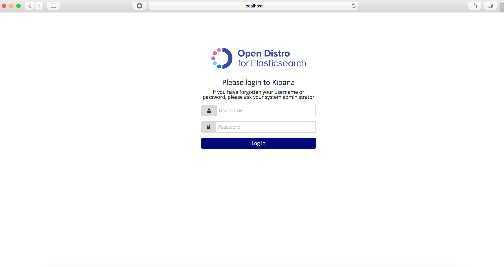
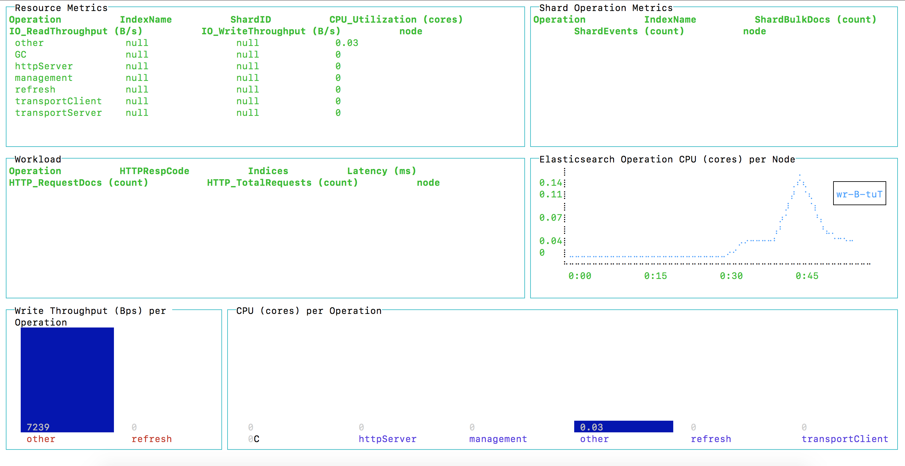
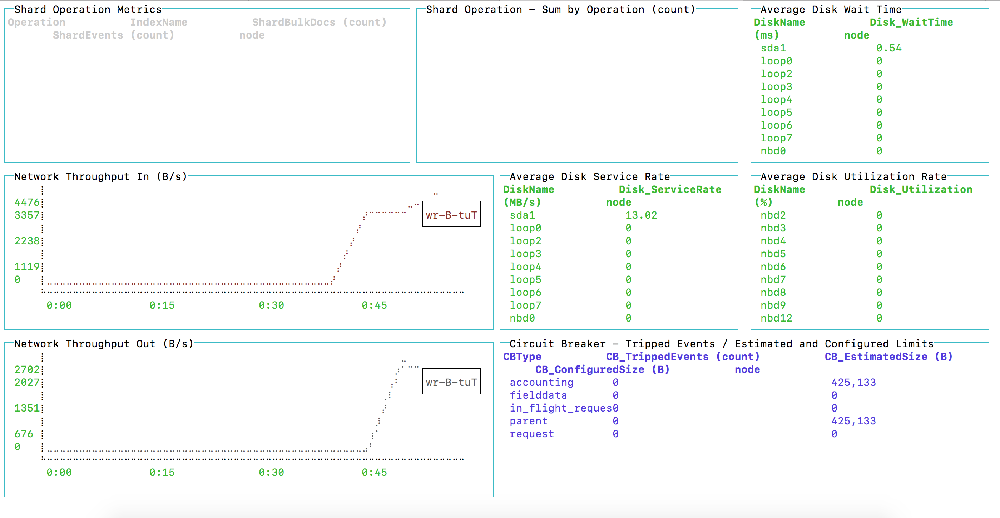
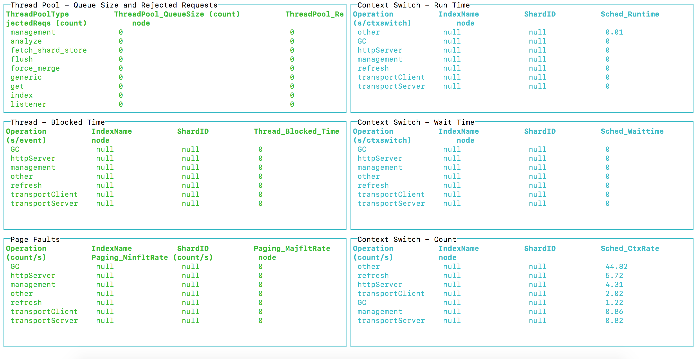
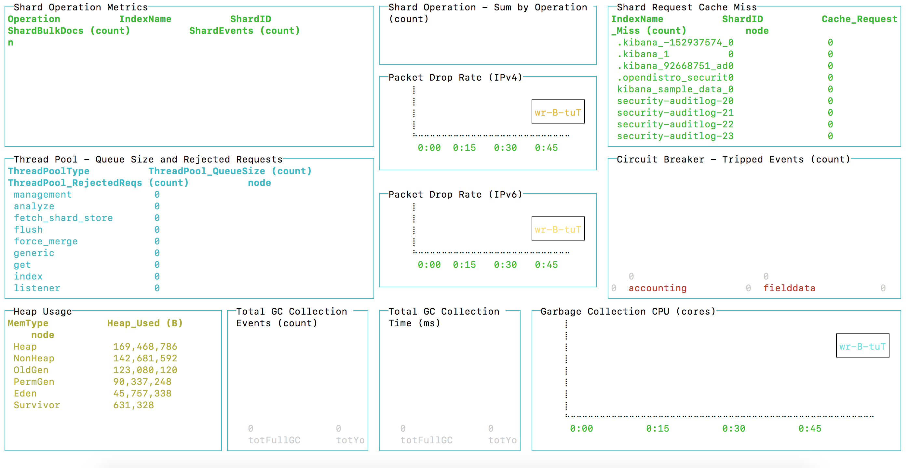

# Open Distro Elasticsearch Application Package

## Prerequisite
- [x] Docker: 18.09.1
- [x] Docker Compose: 1.24.0-rc1
- [x] Docker Swarm enabled (docker swarm init)
- [x] [Docker APP](https://github.com/docker/app)
  - [x] [Download Docker App from here for your Environment](https://github.com/docker/app/releases)

## Deploy Docker Application Package
```
docker-app deploy
```

## Check Status of Docker Services
```
docker service ls
```

## Validate Elasticsearch is running
```
curl -XGET --insecure https://localhost:9200 -u admin:admin
```

## Validate Kibana is running



## PerfTop Cluster Overview Monitoring & Dashboards
```
./perf-top-macos --dashboard dashboards/ClusterOverview.json --endpoint localhost:9600
```


## PerfTop Cluster Network Memory Analysis Monitoring & Dashboards
```
./perf-top-macos --dashboard dashboards/ClusterNetworkMemoryAnalysis.json --endpoint localhost:9600
```


## PerfTop Cluster Thread Analysis Monitoring & Dashboards
```
./perf-top-macos --dashboard dashboards/ClusterThreadAnalysis.json --endpoint localhost:9600
```


## PerfTop Node Analysis Monitoring & Dashboards
```
./perf-top-macos --dashboard dashboards/NodeAnalysis.json --endpoint localhost:9600
```



# Resources:
- [x] [Docker App Examples](https://github.com/docker/app/tree/master/examples)
- [x] [Useful Docker Commands and Aliases](https://medium.com/devopslinks/useful-docker-commands-and-aliases-9ea79191832f)